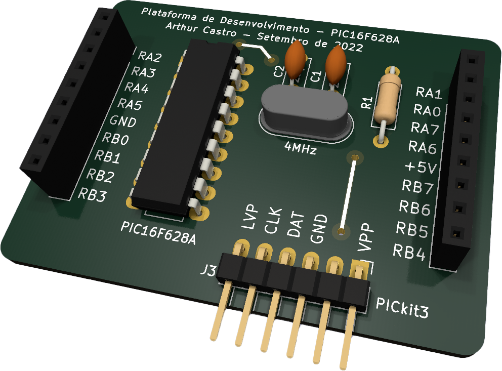
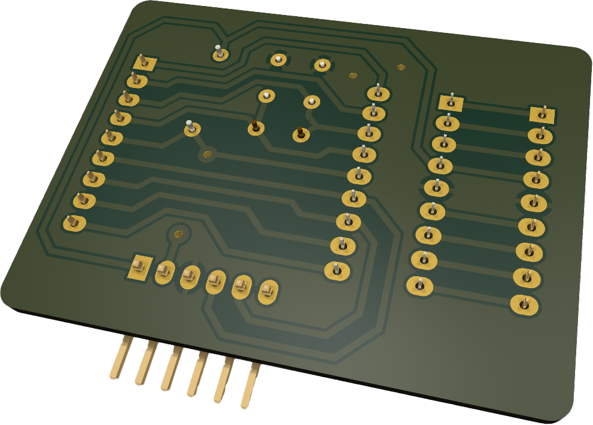
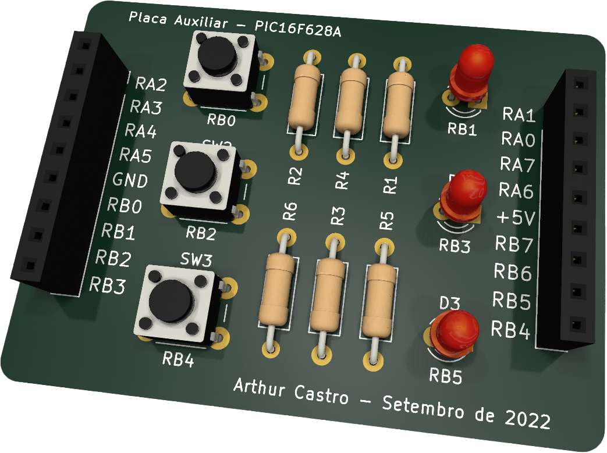
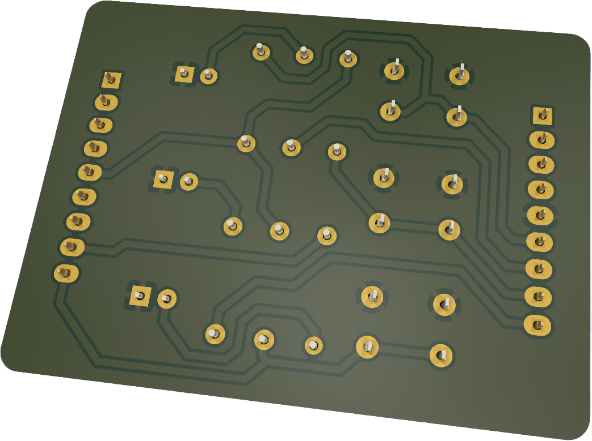

# **Plataforma de Desenvolvimento PIC16F628A**

## **Simulação**
- [Arquivos de simulação do circuito completo](./Simulacao-PIC16F628A_Basic_Circuit/)

## **Placa Principal**

<!--  -->

- [Projeto de PCB da Placa Principal](./Projetos_de_PCB-KiCAD/Placa%20Principal/)

## **Placa Auxiliar (LEDs e Botões)**

<!--  -->

- [Projeto de PCB da Placa Auxiliar](./Projetos_de_PCB-KiCAD/Shield%20LEDs%20e%20Botoes/)
